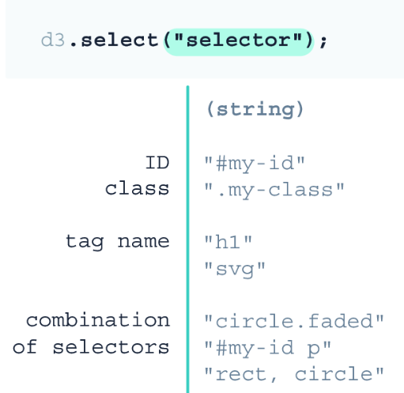

# Einführung in D3js
Jede Anwendung von D§js beginnt mit der Selektion eines DOM-Knotens. Dazu dienen die Funktionen:
- d3.select() 
- d3.selectAll()

**Die Selektoren entsprechen exakt denen, die in CSS gültig sind.**
*Die D3 Select-Funktion liefert immer nur den ***ersten Treffer*** für ein select zurück, nicht so wie css alle!*
Benötigt man mehrere Elemente aus dem DOM dient dazu die `selectAll()`-Funktion

## Die append-Funktion
- hängt an die selection als letztes Element ein Element an, welches als Typ übergeben wird.
```js
d3.selectAll("div").append("p");
 ``` 
## Die attr-Funktion
- dient dazu Attribute am Element zu setzen.
```js
d3.select(".responsive-svg-container")
  .append("svg")
    .attr("viewBox", "0 0 1200 1600");
```

# D3 Module
D3 besteht aus unterschiedlichen Modulen. In diesem Kapitel wird ausschließlich das SELECT-Modul genutzt. Die Module sind vermeintlich unabhängig voneinander nutzbar. Dies muss sich später bestätigen.

# Buchzusammenfassung des Kapitels
- D3 projects require a web server in order to run properly. A quick and easy way to have access to a web server in a local development environment is to use the Live Server extension of VS Code.
- There are two ways to load the D3 library into a project: by adding a script tag to index.html that links to the library or as an NPM module. In the first chapters of this book, we use the script tag approach for simplicity.
- The D3 library can be loaded in its entirety, or we can load only the D3 modules that we need, which can improve the performance of our projects.
- When loading files and libraries via script tags, the order in which the script tags are listed is the same as the order in which the browser will read the scripts. This means that the script tag that links to the D3 library must appear before the script tags that are loading the JavaScript file(s) where we use D3. Otherwise, the browser won’t have access to the D3 methods used in the JavaScript file(s) and will throw errors.
- In D3, we can select elements from the DOM with methods d3.select() and d3.selectAll(). The first method returns only the first element, while the second returns all the DOM elements that match its selector.
- The selector strings passed as an argument to the select() and selectAll() methods are identical to the selectors used in CSS stylesheets. They use tag names, class names, IDs, or a combination of those to identify DOM elements.
- The append() method allows you to add an element as the last child of a selection.
- The attr() method is used to add or modify attributes to an element. It requires two arguments: the name of the attribute and its value.
- The style() method allows you to set and modify the style attribute of DOM elements. It also requires two arguments: the name of the style property and its value.
- With the style() method, we apply inline styles, overwriting styles applied from external CSS stylesheets and via presentation attributes.