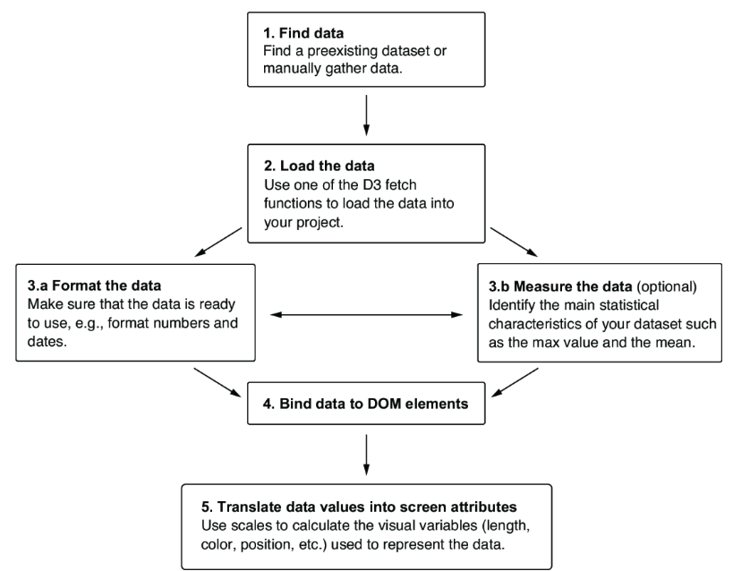
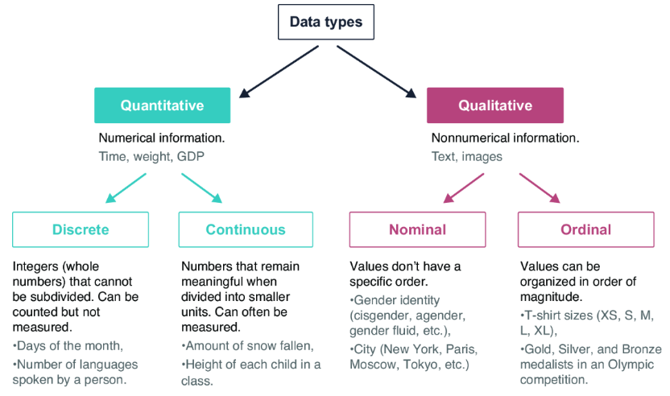
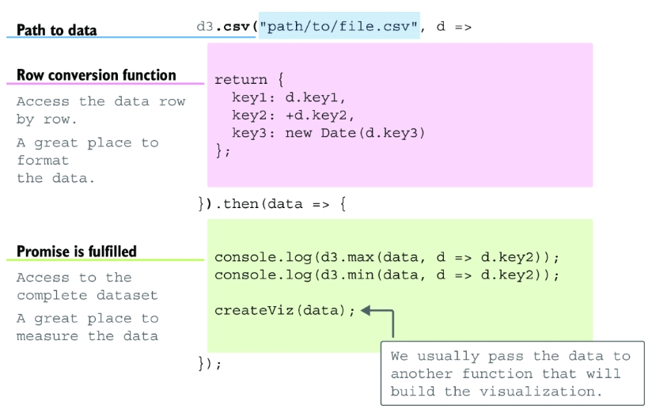
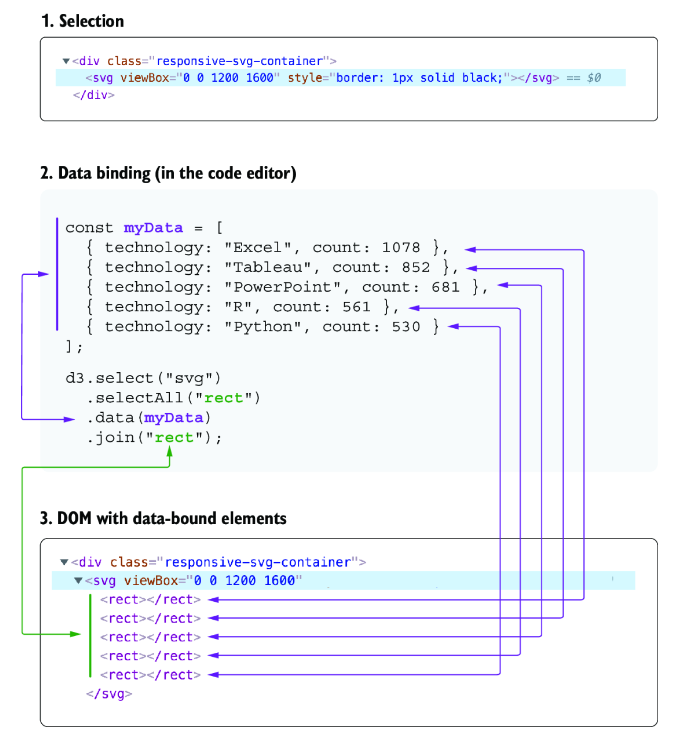
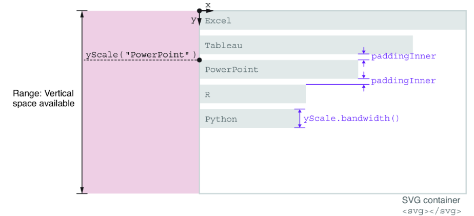
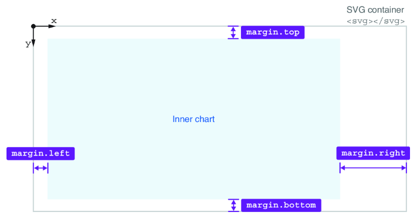

# Mit Daten arbeiten
Ziel des Kapitels ist es, die folgende [Zielgrafik](https://d3js-in-action-third-edition.github.io/most-popular-data-visualization-technologies/) zu erstellen und den Weg dorthin zu beschreiben. Ein wichtiges Thema auf dem Weg sind sogenannte **Scales**, darunter versteht man mathematische Funktionen, die einen Bereich von Zahlen auf einen anderen Bereich von Zahlen abbilden (z.B. Pixel auf dem Bildschirm). Sie dienen dazu, Daten in eine visuell darstellbare Form umzuwandeln.


***Dataworkflow für D3, was zunächst unlogisch erscheint ist, dass zunächst die Daten gebunden und erste dann skaliert werden***

## Daten verstehen
Im Buch wird eine Reihe interessanter Datenquellen genannt:
- [Data.world](https://data.world/)
- [Kaggle](www.kaggle.com/)
- [World Bank Open Data](https://data.worldbank.org/)
- [Our World in Data](https://ourworldindata.org/)
- [EarthData](https://www.earthdata.nasa.gov/)
- [EU Open Data Portal](https://data.europa.eu/)
- [Data.gov](https://data.gov/)
- [openAfrica](https://africaopendata.org/)
- [Dataportal.asia](https://dataportal.asia/)
- [Weather-Underground Wetterdaten aus New York für Kapitel 4](https://www.wunderground.com)
- [Autotype-Artikel beim Laden von Daten](https://observablehq.com/@d3/d3-autotype)

## Datentypen
Zunächst einmal lassen sich 

- qualitative und 
- quantitative Daten 

unterscheiden. Qualitative Daten sind nicht numerisch, Beispiele dafür sind

- Geschlecht
- Bezeichnungen wie z.B. Städtenamen

Es gibt bei den qualitativen Daten solche, die sich in eine Reihenfolge bringen lassen und solche, die ohne order sind. T-Shirt-Größen (XS, S, M, L, XL) sind ein Beispiel für geordnete qualitative Daten.



## Datenformate und -strukturen
- json
- raw
- geographic data
- Tabellendaten / csv-Daten
- Netzwerkdaten
- verschachtelte Daten (nested data)

### Tabellendaten
D3 besitzt drei Funktionen, um csv- bzw. Tabellendaten zu lesen:
```javascript
d3.csv();     // comma-separated-data
d3.tsv();     // tab-separated-data
d3.dsv();     // delimiter-separated-data 
```

### JSON-daten
```javascript
d3.json();    // wird genutzt um JSON-Daten zu lesen 
```
***Sämtliche dieser Funktionen zum Laden von Daten sind Teil des [Fetch-Moduls](https://d3js.org/d3-fetch) und bekommen als ersten Parameter den Pfad zu den Daten übergeben.***
Die Funktionen zum Laden der Daten sind sämtlich asynchron, man muss also darauf achten, dass sie entweder mittels `and` oder `or` weiterverarbeitet werden oder dass man einen JavaScript Promise verwendet. Auf der D3 Seite wird jeweils ein `await` verwendet:
```javascript
const data = await d3.csv("hello-world.csv");
```

### Verschachtelte Daten
Verschachtelte Daten (nested data) zeichnet sich dadurch aus, dass man die Daten in einer Hierarchie anzeigen kann. Wichtig ist, dass jeder Knoten in dem Netz nur einen Vorfahren besitzt, dadurch lassen sich Bäume aufspannen.

### Netzwerkdaten
Netzwerkdaten existieren aus einer Reihe von Knoten, die miteinander verbunden sind. In Netzwerkdaten gibt es n:m-Beziehungen. Für die Darstellung gibt es ein eigenes Kapitel. Eine interessante Seite dazu könnte diese sein [OpenGraph-Plattform](https://gephi.org). Netzwerke sind also ganz allgemeine Graphen.

### geographische Daten
Bestehen aus Points oder Shapes und können vielfältig dargestellt werden wie in den [Beispielen für Darstellungen](https://observablehq.com/@d3/gallery#maps) zu sehen. 

Für Geo-Daten gibt es unterschiedliche Standards, im Buch werden GeoJSON und TopoJSON behandelt.

[PostGIS](https://postgis.net/) scheint ein GIS zu sein, das frei nutzbar ist und auf [PostgreSQL](https://www.postgresql.org/) aufbaut. 

### RAW Daten
Werden in der Regel mit Bildern und Text dargestellt, wenn eine Bearbeitung nicht möglich scheint oder zu aufwendig ist. D3 unterstützt diese Form der Darstellung, mit *echter* Datenverarbeitung vor der Darstellung hat dies weniger zu tun.

## Laden der Daten
Die folgende Grafik fasst das Laden, Konvertieren und Messen der Daten seht gut zusammen
 Im Quelltext findet man den echten Code dazu.

## Binden der Daten
Beim Binden der Daten findet die Abbildung eines Array- oder eines anderen Eintrags aus den geladenen Daten an ein View-Element statt. Oft muss dieses noch neu erzeugt werden. Der Trick besteht darin, dass eine Eigenschaft eines View-Elements durch einen Dateneintrag und somit durch den Wert eines Datums aus dem Datensatz ausgedrückt wird.

```javascript
svg
    .selectAll("rect") // jeder CSS-Selektor ist möglich, ein Element-Type ist üblich
    .data(myData) // erst durch die Daten weiß D3 wieviele Rechtecke erzeugt werden sollen
    .join("element to add");
```
Nach diesem Schritt sind die Daten mit den Elemente der View verknüpft. Immer wenn man auf ein Element zugreift, hat man auch Zugriff auf dessen Daten.


# Skalierung oder Scales
Der letzte Schritt einer standardmäßigen Bearbeitung besteht darin, die Daten, die an die Oberflächenelemente gebunden sind, so zu skalieren, dass die Darstellung sinnvoll wird oder sie noch zu verbessern. D3 bietet dafür die sogenannten Scales an.

## Definition "Scales"
Scales sind Funktionen, die einen Wert des Data-Sets als Input haben und einen Output-Wert haben, der direkt als Eigenschaft des Visualisierungs-Attributs (z. B. size, position, color) des anzuzeigenden Elements genutzt werden kann.

Man kann die Daten aus dem Datensatz als Werte einer Domain betrachten, diese Werden dann transformiert, im einfachsten Fall linear:

```javascript
const myScale = d3.scaleLinear()
  .domain([0, 200])
  .range([0, 20]);

myScale(100) // liefert dann 10, wie oben gesagt ist myScale eine Funktion

domain => [0, 100] possible min and max values of the input, in %
range  => [0, 500] related min and max values of the output, in pixels

domain => ["Drama", "Action", "Crime", "Comedy"] possible inputs
range  => ["purple", "blue", "green", "yellow"]  corresponding outputs

domain => [60, 70, 80] thresholds of the input values
range  => ["o˜˜˜o", "●_●", "‒‿‒", "♥‿♥"] corresponding output

domain => ["Nine Perfect Strangers", "Maid", "Katla", ...] list of inputs
range  => [0, 500] related min and max values of the output, in pixels

```


Ein in dem Beispiel verwendetes Scaling ist das Band-Scaling
```javascript
const svg = d3.select("svg")
    .attr("width", 500)
    .attr("height", 300);

const data = ["Apples", "Bananas", "Oranges"];

const x = d3.scaleBand()
    .domain(data)
    .range([0, 400])
    .padding(0.2);

svg.selectAll("rect")
    .data(data)
    .enter()
    .append("rect")
    .attr("x", (d) => x(d))
    .attr("y", 50)
    .attr("width", x.bandwidth())
    .attr("height", 50);
```


**Wie BandScale arbeitet und welche Eigenschafte es kennt**

Bei den Scales muss man folgende vier Typen unterscheiden, die den Wertebereich betreffen:
- Scales with a continuous input and a continuous output
- Scales with a discrete input and a discrete output
- Scales with a continuous input and a discrete output
- Scales with a discrete input and a continuous output

Die Scales sind in D3 als eigenes Modul definiert. Es gibt über 20 Scale-Funktionen und im Buch
ist eine Entscheidungs-Matrix, um die richtige zu ermitteln.

# Die Margin-Konvention
Die Margin-Konvention beschreibt das Verhalten von D3, dass von Anfang an Platz für die
Beschriftung der Skalen eingeplant wird. Die Planung von Anfang an, ist wichtig, um später 
nicht die Größen dauernd anpassen zu müssen.



Man bedient sich dann eines Tricks und platziert die Grafik mit einem Group-Objekt in  das inner Chart. Dies hat den Vorteil, dass man die Transformation nur auf diese Group-Objekt
anwenden muss. Somit kann man Kurve und Axen gut voneinander trennen.

# Achsen erzeugen
Achsen werden in D3 ezeugt, indem man ein Scale an die Funktion `axis()` übergibt.
