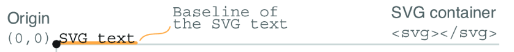
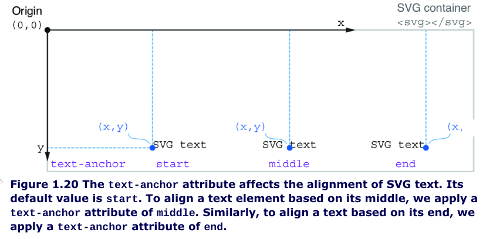

# Wie SVG arbeitet
- der Name steht für Data Driven Documents = D3.js
- SVG produziert einen DOM-Baum
- werden via `<svg></svg>` im Browser eingebunden
- können auch via `` eingebunden werden
- es gibt einige Grundelemente wie `circle , line ellipse`
- Strukturelemente gliedern die Elemente
- Elemente oben im Dokument werden zuerst gerendert, dann allerdings durch später dazukommende verdeckt,
wenn diese gleiche Zeichenflächen haben
- Ursprung des Koordinatensystems ist die obere rechte Ecke
- Interaktivität durch Event-Handler ist möglich
- Polygone sind geschlossene Figuren
- Polylines erzeugen Graphen aus geraden Linien
- Paths erzeugen einfache oder komplexe Formen indem sie gerade und kurvige "Linien" miteinander verbinden

# In SVG heißt der Parameter, der zu setzen ist, oft d, daher ist er auch bei d3 so genannt d steht für draw und kann man beim path Beipsiel gut sehen..

### Paths haben eine Reihe von eigenen Befehlen:
Required. A set of commands which define the path.
The following commands are available for path data:

- M = move to (move from one point to another point)
- L = line to (create a line)
- H = horizontal line to (create a horizontal line)
- V = vertical line to (create a vertical line)
- C = curve to (create a curve)
- S = smooth curveto (create a smooth curve)
- Q = quadratic Bézier curve (create a quadratic Bézier curve)
- T = smooth quadratic Bézier curveto (create a smooth quadratic Bézier curve)
- A = elliptical Arc (create a elliptical arc)
- Z = closepath (close the path)
Note: All of the commands above can also be expressed in lower case. Upper case means absolutely positioned, lower case means relatively positioned.

# viewBox-Attribut des SVG-Elements
Das viewBox-Attribut ist ein leistungsstarkes Werkzeug in SVG, das es ermöglicht, die Darstellung deiner Grafik innerhalb eines bestimmten Bereichs zu kontrollieren und zu skalieren.

## Die Parameter des viewBox-Attributs:

Das viewBox-Attribut nimmt vier Werte an, die durch Leerzeichen oder Kommas getrennt werden:

- min-x: Die x-Koordinate des linken oberen Eckpunkts des ViewBox. Dies definiert den Ursprung des Koordinatensystems innerhalb der ViewBox.
- min-y: Die y-Koordinate des linken oberen Eckpunkts der ViewBox.
- width: Die Breite der ViewBox.
- height: Die Höhe der ViewBox.

## Was macht das viewBox-Attribut?
Definiert ein Koordinatensystem: Das viewBox-Attribut erstellt ein eigenes Koordinatensystem innerhalb des SVG-Elements. Dieses Koordinatensystem ist unabhängig von den tatsächlichen Pixelmaßen des SVG-Elements.
Skaliert und positioniert: Die Inhalte innerhalb des SVG-Elements werden so skaliert, dass sie in die ViewBox passen. Die Position der Inhalte innerhalb der ViewBox wird durch die angegebenen Koordinaten bestimmt.
Ermöglicht responsives Design: Durch die Verwendung von viewBox kannst du sicherstellen, dass deine Grafiken auf verschiedenen Bildschirmgrößen und Geräten gut aussehen, da sie sich automatisch an die verfügbare Fläche anpassen.
Ein Beispiel:

```html
<svg width="200" height="200" viewBox="0 0 100 100">
  <circle cx="50" cy="50" r="40" fill="blue" />
</svg>
```
Verwende den Code mit Vorsicht.

In diesem Beispiel:

Das SVG-Element hat eine Breite und Höhe von 200 Pixeln.
Die ViewBox hat eine Breite und Höhe von 100 Einheiten (nicht Pixel).
Der Kreis wird bei den Koordinaten (50, 50) innerhalb der ViewBox gezeichnet und hat einen Radius von 40 Einheiten.
Da die ViewBox kleiner ist als das SVG-Element, wird der Kreis vergrößert, um den gesamten verfügbaren Raum auszufüllen.

Zusammenfassung:

Das viewBox-Attribut ist ein mächtiges Werkzeug, um die Darstellung deiner SVG-Grafiken zu kontrollieren. Durch die Definition eines eigenen Koordinatensystems kannst du deine Grafiken skalieren, positionieren und sicherstellen, dass sie auf verschiedenen Geräten gut aussehen.

Weitere wichtige Punkte:

Einheiten: Die Einheiten in der ViewBox sind beliebig und müssen nicht mit den Einheiten des SVG-Elements übereinstimmen.
Aspect Ratio: Das `preserveAspectRatio`-Attribut kann verwendet werden, um das Seitenverhältnis der Grafik beizubehalten, wenn sie skaliert wird.

## Text in SVGs
- Text in SVGs kann von Screenreadern gelesen werden.
- während alls bisherigen Elemente Kreis Ellipse... in selbstschließende HTML-Elemente geschrieben wurden, wird SVG-Text wie in HTML-Üblich zwischen die Tags geschrieben.
`<text>Dies ist ein SVG-Text</text>`
- standardmäßig wird die Position von Text von seiner Baseline berechnet  
- SVG text bricht nicht von selbst um, wie das Text in div-Elementen tut, daher müssen das x und das y Attribute jedes Text-Elements individuell gesetzt werden.
- mit dem text-anchor kann man Texte genauer platzieren


## Das SVG g-Element
`<g>` steht für group, das `<g>`-Element ist ein nicht sichtbares Element.


Das `<g>`-Element in SVG ist ein nützliches Werkzeug, um mehrere SVG-Elemente zu gruppieren. Dadurch kann diese Gruppe als eine Einheit behandelt werden, sehr nützlich z. B, bei Transformationen (wie Skalierung, Rotation oder Verschiebung), die auf die gesamte Gruppe angewendet werden.

Beispiel:

```html
<svg width="200" height="200">
  <g fill="blue" transform="translate(50, 50)">
    <rect x="0" y="0" width="50" height="50" />
    <circle cx="25" cy="25" r="20" />
  </g>
</svg>
```

Noch interessanter wird dies bei dynamischen Transformationen, die man in D3.js nutzen kann. Mann kann das Element auch sehr gut dazu nutzen Eigenschaften, die alle Elemente der Gruppe gleich haben, der Gruppe zu geben.

### letzte Bemerkung
***Man sollte mit SVG-Mitteln maximal 1000 Elemente erzeugen*** (as an accepted rule of thumb), ***sonst wird die Belastung für den Browser zu hoch. Alles was darüberhinaus geht, sollte man mit einem Canvas erzeugen.*** 

## Links
[SVG-Tutorial](https://www.w3schools.com/graphics/svg_intro.asp)

[https://github.com/d3js-in-action-third-edition/](http://mng.bz/Xqjv)

[Mozilla](https://developer.mozilla.org/)

[D3JS](https://d3js.org/)

[Visualisierungsbeispiele wie Jupyter-Notebooks](https://observablehq.com/)

[Onlineeditor Codepen auch wie Jupyter...](https://codepen.io/)

[Tutorial zu den Notebooks (auf der Seite nach Tutorials suchen)](https://observablehq.com/documentation/)